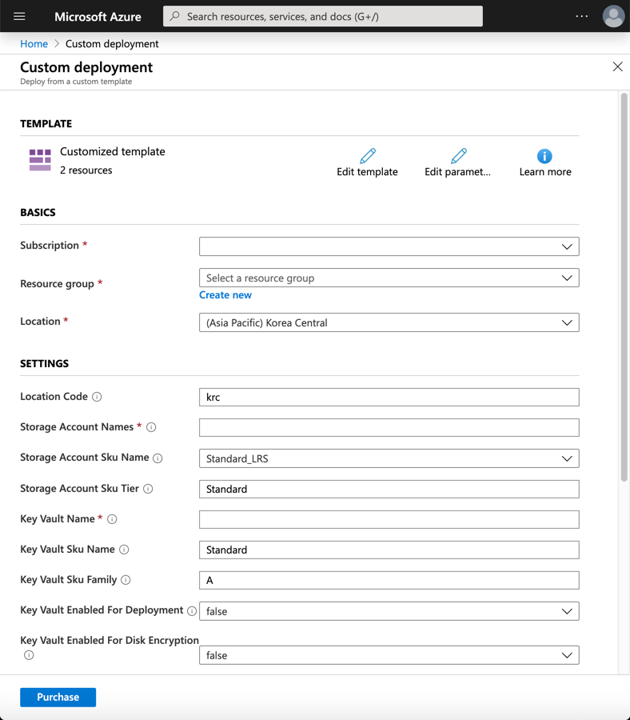
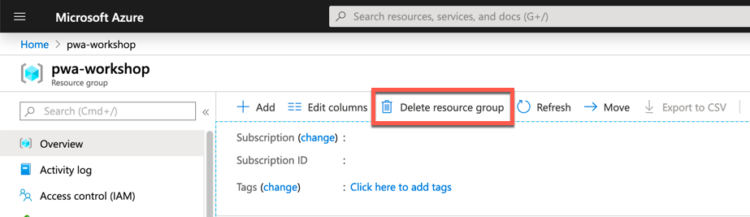

# 애저 리소스 프로비저닝 #

## 애저 포탈 ##

### 애저 리소스 프로비저닝 ###

애저 포탈에서 직접 한꺼번에 리소스를 프로비저닝하기 위해서는 아래 버튼을 클릭합니다.

<a href="https://portal.azure.com/#create/Microsoft.Template/uri/https%3A%2F%2Fraw.githubusercontent.com%2Fdevkimchi%2Fpwa-workshop%2Fmaster%2Fresources%2Fazuredeploy.json" target="_blank"></a>

로그인 후에는 아래와 같은 화면이 보입니다. 여기서 기본값이 지정되어 있지 않은 곳은 임의로 값을 지정하여 입력합니다.




### 애저 리소스 삭제 ###

아래 그림과 같이 리소스 그룹 전체를 삭제합니다. 이 버튼을 클릭하면 이 리소스 그룹 안에 있는 모든 리소스들을 삭제시킵니다.




## 애저 CLI ##

### 리포지토리 포크 ###

아래 리포지토리를 본인의 계정으로 포크합니다. 모든 실습은 본인의 계정으로 포크한 리포지토리를 통해 진행합니다.

> https://github.com/devkimchi/pwa-workshop


### 리포지토리 클론 ###

파워셸 콘솔 혹은 터미널에서 아래와 같은 명령어를 입력합니다.

```bash
git clone https://github.com/<username>/pwa-workshop.git
```


### 애저 CLI 로그인 ###

```bash
az login
```


### 애저 리소스 그룹 생성 ###

```bash
az group create \
  -n <RESOURCE_GROUP_NAME> \
  -l koreacentral \
  --verbose
```


### ARM 템플릿 실행 ###

먼저 아래와 같이 `azuredeploy.parameters.json` 파일을 수정합니다.

```json
{
  "$schema": "https://schema.management.azure.com/schemas/2019-04-01/deploymentParameters.json#",
  "contentVersion": "1.0.0.0",
  "parameters": {
    "storageAccountNames": {
      "value": "[COMMA_DELIMITED_STORAGE_ACCOUNT_NAME]"
    },
    "keyVaultName": {
      "value": "[KEY_VAULT_NAME]"
    }
  }
}
```

그리고 난 후 아래 커맨드를 실행시킵니다.

```bash
az group deployment create \
  -n storage-account \
  -g <RESOURCE_GROUP_NAME> \
  --template-file resources/azuredeploy.json \
  --parameters @resources/azuredeploy.parameters.json \
  --verbose
```

> **트러블슈팅**: 만약 ARM 템플릿 실행에 실패할 경우, 앞서 애저 포탈을 통해 만들었던 애저 키 저장소가 완벽하게 지워지지 않았을 수도 있습니다. 이럴 땐 아래 명령어를 통해 애저 키 저장소를 수동으로 완전히 삭제합니다.
> ```bash
> az keyvault purge \
>   -n <KEY_VAULT_NAME> \
>   -l koreacentral \
>   --verbose
> ```
